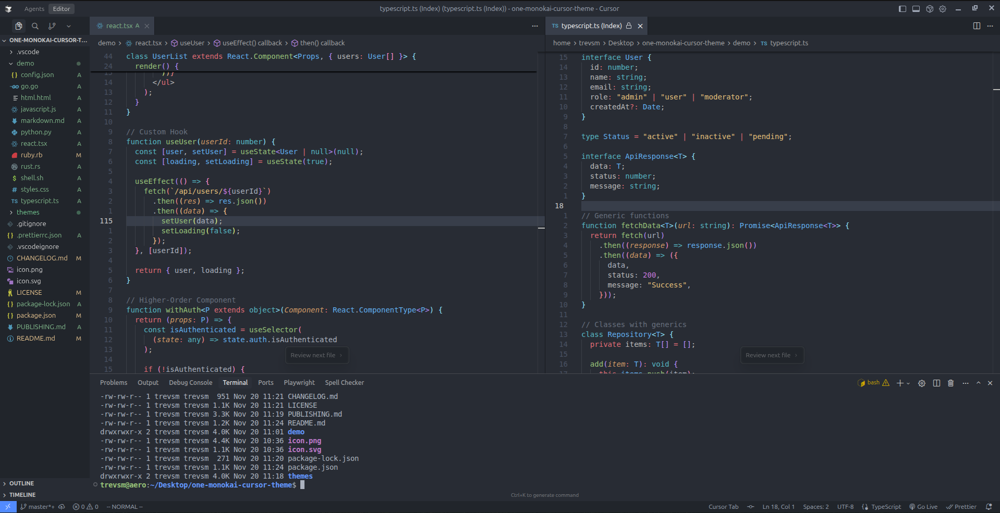

# Cursor Monokai Theme

A beautiful dark theme for Cursor IDE - A cross between Monokai and One Dark themes

> **Note:** This is a modified version of the original [One Monokai Theme](https://github.com/azemoh/vscode-one-monokai) by Joshua Azemoh, customized and optimized for Cursor IDE by trevsm.

## Install

### From Cursor IDE Extensions

This theme is optimized for Cursor IDE and can be installed from the Open VSX Registry:

1. Open Cursor IDE
2. Go to Extensions (Ctrl+Shift+X)
3. Search for "Cursor Monokai Theme" by trevsm
4. Click Install

### Manual Installation from VSIX

1. Download the `.vsix` file from the [releases page](https://github.com/trevsm/cursor-monokai-theme/releases)
2. In Cursor IDE, go to Extensions → "..." → "Install from VSIX..."
3. Select the downloaded `.vsix` file

## Screenshot

Screenshot of TypeScript and React

## Credits

This theme is based on the original [One Monokai Theme](https://github.com/azemoh/vscode-one-monokai) by [Joshua Azemoh](https://github.com/azemoh), which combines elements from Monokai and One Dark themes.

## Change log

You can take a look at the change log [here](CHANGELOG.md)
